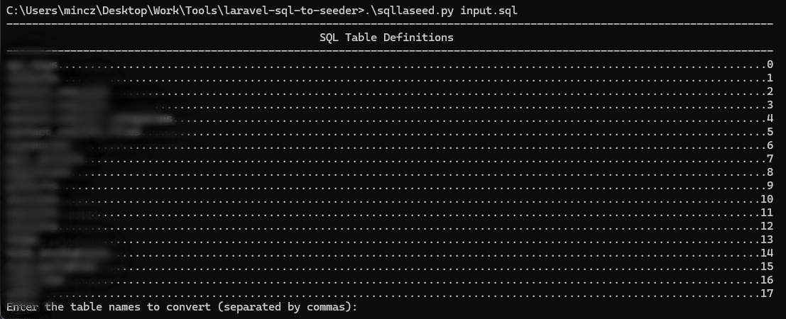

# laravel-sql-to-seeder

## Dependencies
- Python >= 3.5

### Required pip packages
- [sqlparse](https://pypi.org/project/sqlparse/)
- os, sys

## Convert SQL Database exports to Laravel Seeders
1. Run `python sqllaseed.py <file.sql>` 
    >You could also use `sqllaseed.py <file.sql>` if you have Python in your PATH.

2. Enter the names of the tables to export separated by commas( , )

3. Enter Laravel Eloquent model class for each table

4. The file will be exported to `<PHP Class Name>.php`

Made by [KOna](https://github.com/KOna115), have fun using it!
> If you like it please consider 
⭐ Starring the Repo or ☕[Buying me a coffee](https://www.buymeacoffee.com/kona115)